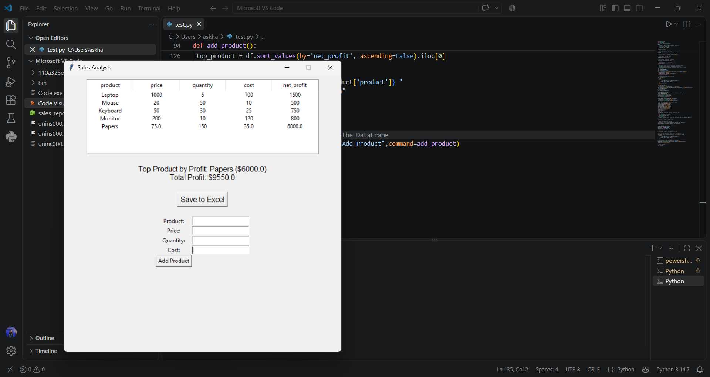

# Sales-Analysis-
A Python Tkinter desktop application for simple sales analysis and management
# 📊 Sales Analysis App

A desktop application built with Python using **Tkinter** and **Pandas** to manage and analyze sales data.

## 🚀 Features

* ➕ **Add New Products**: Easily enter product name, price, quantity, and cost.
* 📈 **Automatic Profit Calculation**: Automatically computes net profit per item and total profit.
* 🏆 **Top Product Highlight**: Identifies and displays the top-performing product by profit.
* 💾 **Excel Export**: Save sales reports directly to an Excel file.

## 🛠️ Built With
* 🐍 **Python 3**
* 🖼️ **Tkinter** (GUI)
* 🐼 **Pandas** (Data Analysis)

## 💻 How to Run
1. Clone the repository:
   ```bash
   git clone [https://github.com/AminaSalahKh/Sales-Analysis-.git](https://github.com/AminaSalahKh/Sales-Analysis-.git)
